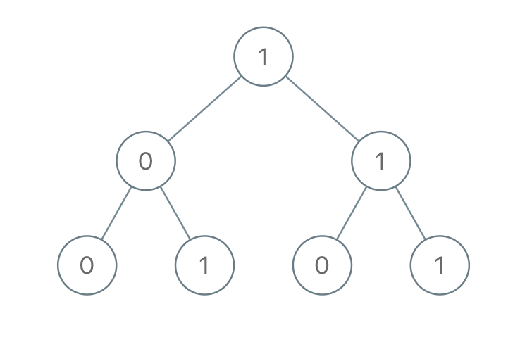

Given a binary tree, each node has value 0 or 1.  Each root-to-leaf path represents a binary number starting with the most significant bit.  For example, if the path is 0 -> 1 -> 1 -> 0 -> 1, then this could represent 01101 in binary, which is 13.

For all leaves in the tree, consider the numbers represented by the path from the root to that leaf.

Return the sum of these numbers.

 

Example 1:



Input: [1,0,1,0,1,0,1]
Output: 22
Explanation: (100) + (101) + (110) + (111) = 4 + 5 + 6 + 7 = 22
 

Note:

The number of nodes in the tree is between 1 and 1000.
node.val is 0 or 1.
The answer will not exceed 2^31 - 1.

分析：该问题可以分解为两个部分：
- 找到root to leaf的所有路径，这一部分可以使用DFS
- 将所有路径的二进制转为十进制求和
分开来做的花需要O（2N）的时间复杂度。这里可以直接在遍历过程中进行计算，并返回对应的结果。考虑到二进制每增加一位，就是\*2，可以每加深一层，结果\*2.


```python
class Solution:
    def sumRootToLeaf(self, root: TreeNode,val=0) -> int:
        if not root: return 0
        val = val*2+root.val
        if not root.left and not root.right :return val
        return self.sumRootToLeaf(root.left,val)+self.sumRootToLeaf(root.right,val)
        
        
```